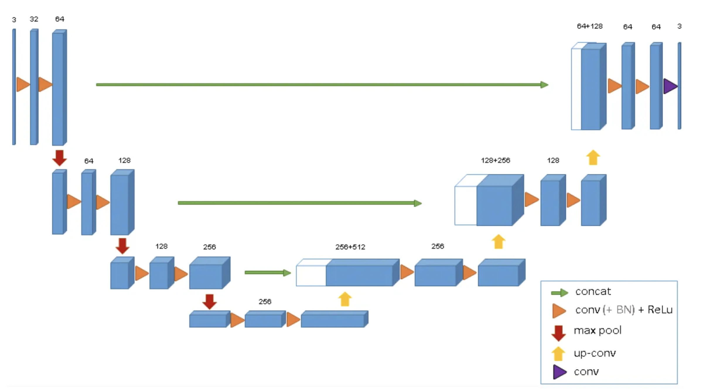
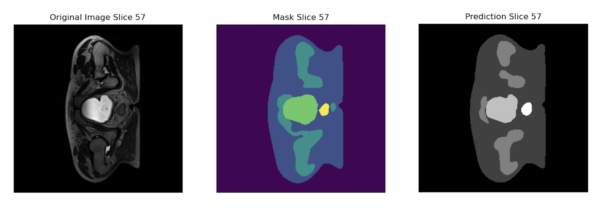

# 3D U-Net for MRI Segmentation
## Description
This repository contains a PyTorch implementation of a 3D U-Net
model for semantic segmentation of MRI images. The algorithm is 
designed to accurately segment medical images by predicting 
pixel-level masks. The problem solved by this algorithm is 
vital in medical image analysis, where precise segmentation 
helps in diagnosing conditions, planning treatment, and 
evaluating therapy outcomes. Specifically, this implementation 
focuses on semantic segmentation of MRI scans from the HipMRI 
Study dataset. 


## How It Works
The 3D U-Net architecture, as implemented in the code, 
is a convolutional neural network designed to process 3D 
input volumes, making it particularly effective for segmenting 
volumetric medical data like MRI scans. The model utilizes an 
encoder-decoder structure, where the encoder (contracting path)
uses ResNet blocks to compress the input into a 
lower-dimensional latent space, and the decoder (expanding path)
reconstructs the segmentation mask. Skip connections between the
encoder and decoder layers preserve essential spatial information
by concatenating the corresponding feature maps, ensuring that 
fine details lost during downsampling are recovered.

In this implementation, the encoder applies downsampling 
through 3D convolutions and max pooling, while the decoder 
uses upsampling with transposed convolutions to generate 
segmentation predictions. Each voxel (3D pixel) in the output 
receives a class label that corresponds to a structure such 
as an organ or lesion.

The code also incorporates ResNet-style blocks in the 
encoder and bottleneck layers, enhancing the model’s feature 
extraction by including residual connections, which help 
stabilize training. These connections allow the network to 
better capture complex structures in the input volumes, 
leading to more accurate segmentation.

The diagram below illustrates an example 3D U-Net architecture, 
showing 
how the model processes input volumes and generates segmentation 
masks:



### Visualization
Below is an example visualization of the segmentation process for a given slice from an MRI scan:
- **Left**: Original MRI slice
- **Center**: Ground truth segmentation mask
- **Right**: Model prediction




## Dependencies
To run the code, you need the following dependencies:
* Python 3.12
* PyTorch 2.0.0
* Torchvision 0.15.0
* Matplotlib 3.8.0
* Nibabel 5.2.0
Make sure to install these using `pip` or `conda`. For example:

```bash
pip install torch torchvision matplotlib nibabel
```

## Reproducibility
To ensure reproducibility, all random seeds are set explicitly 
within the training script. If you want to reproduce the 
results exactly, ensure the same dataset splits, 
hyperparameters, and model initialization are used. The model 
weights are stored and can be reloaded from `model/new_model.pth`. 
The code relies on personalised paths to data. For personal use, 
download the data here: https://doi.org/10.25919/45t8-p065 and 
change the file paths in `train.py` and `predict.py`.


## Example Inputs and Outputs

### Input
The input to the model is a batch of MRI images in NIfTI 
format, typically with dimensions `(depth, height, width)`. 
These are loaded using the `nibabel` library and processed as 
3D arrays.

**Example Input:**
- MRI Volume: `Case_040_Week5_SEMANTIC_LFOV.nii.gz`

### Output
The model outputs a 3D segmentation mask, where each voxel is 
assigned a class label corresponding to the target structure.

**Example Output:**
- Segmentation mask: A 3D array of dimensions `(depth, height, width)` with integer values representing class labels.

Below is a sample input MRI slice and mask, with the corresponding 
segmentation output.


## Pre-processing
Before training, the MRI volumes were normalized to ensure 
consistent intensity distribution across the dataset. 
Additionally, each MRI scan was resized to a fixed resolution 
to match the input dimensions required by the 3D U-Net. Data 
augmentation techniques such as random rotations, flipping, 
and cropping were applied to increase the diversity of the 
training data.

## Data Splitting
The dataset was split into **training (80%)**, 
**validation (10%)**, and **testing (10%)** subsets. 
This split was chosen to ensure a sufficient amount of data 
for training while reserving enough data for accurate 
evaluation. The data was stratified by cases to ensure that 
images from the same subject were not present in multiple 
sets, which could otherwise lead to overfitting.

## Results
The 3D U-Net model was trained for 16 epochs, with early 
stopping applied after **Epoch 12**. Below is a summary of 
the key results from the training process:

 - Epoch [1/16], Loss: 0.7396
   - Class-specific Dice Scores: [0.98168078 0.91843471 0.05575329 0.44867237 0.00546562 0.1901122 ]
 - Epoch [2/16], Loss: 0.4922
   - Class-specific Dice Scores: [0.98146727 0.77852851 0.3306287  0.07353068 0.00168459 0.01371561]
- Epoch [3/16], Loss: 0.3613 
  - Class-specific Dice Scores: [0.98314504 0.9352279  0.46974399 0.49166848 0.38004141 0.12213351]
- Epoch [4/16], Loss: 0.2760
  - Class-specific Dice Scores: [0.98131116 0.94516828 0.74051519 0.41558598 0.49725519 0.47306966]
- Epoch [5/16], Loss: 0.2228
  - Class-specific Dice Scores: [0.98536606 0.95066454 0.75680236 0.5930551  0.43019679 0.41207429]
- Epoch [6/16], Loss: 0.1871
  - Class-specific Dice Scores: [0.98399602 0.94690789 0.67935657 0.46950318 0.65837656 0.62739768]
- Epoch [7/16], Loss: 0.1678
  - Class-specific Dice Scores: [0.98218483 0.95115498 0.77507274 0.65916569 0.6241418  0.57728968]
- Epoch [8/16], Loss: 0.1433
  - Class-specific Dice Scores: [0.98212918 0.950911   0.78564328 0.67374016 0.68587627 0.40712179]
- Epoch [9/16], Loss: 0.1291
  - Class-specific Dice Scores: [0.9842072  0.95312278 0.78852241 0.62817013 0.59529447 0.50053505]
- Epoch [10/16], Loss: 0.1204
  - Class-specific Dice Scores: [0.98578121 0.95990683 0.81827442 0.73743585 0.68902261 0.5927277 ]
- Epoch [11/16], Loss: 0.1071
  - Class-specific Dice Scores: [0.97903265 0.95000044 0.82465145 0.79983808 0.71879922 0.68511068]
- Epoch [12/16], Loss: 0.1043
  - Class-specific Dice Scores: [0.98194693 0.95313792 0.76935486 0.77318901 0.72986509 0.75210351]
- Early stopping at epoch 12, all classes have Dice scores ≥ 0.7
  - Test Loss: 0.1276
  - Test Class-specific Dice Scores: [0.98341535 0.95497757 0.78998656 0.79622618 0.72969815 0.76118778]


  Evident above, the model achieves >0.7 dice similarity score 
  for each class. Initially, the performance of the last two classes 
was poor due to smaller and/or more complex regions. Weighting was introduced
to ensure that smaller, potentially clinically relevant structures are well-learned by the model.

## Reflections and Future Work
Task was very challenging and took time management across 4 weeks 
to complete. The topic of segmenting MRI imaging was quite 
interesting and very rewarding once the code was complete. For future 
work I would improve the prediction output colours as I didn't 
have time to run the code again to get the image mask and prediction 
the same colour. It would be interesting to see how much the performance improves
with an increased number of epochs as well. I would remove the early stopping 
and train the model for 32 epochs to see how performance changes. I am also curious to see
how the model performs with more sample data. Collecting more MRI images and feeding the through the model
to test performance would be very benficial.

## References
- F. Isensee, P. Kickingereder, W. Wick, M. Bendszus, and K. H. Maier-Hein, “Brain Tumor Segmentation
and Radiomics Survival Prediction: Contribution to the BRATS 2017 Challenge,” Feb. 2018. [Online].
Available: https://arxiv.org/abs/1802.10508v1- 
- Dowling, Jason; & Greer, Peter (2021): Labelled weekly MR images of the male pelvis. v2. CSIRO. Data Collection. https://doi.org/10.25919/45t8-p065
- Soleimani, P. and Farezi, N.
Soleimani, P., & Farezi, N. (2023). Utilizing deep learning via the 3D U-net neural network for the delineation of brain stroke lesions in MRI image. Retrieved from https://www.nature.com/articles/s41598-023-47107-7
- Wolny. (n.d.). wolny/pytorch-3dunet: 3D U-Net model for volumetric semantic segmentation written in pytorch. Retrieved from https://github.com/wolny/pytorch-3dunet
